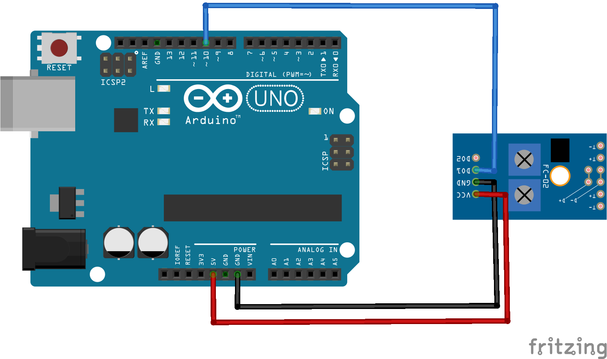

# Módulo TCRT5000 
Práctica con el Módulo TCRT5000 para identificar cuando pasa sobre una línea negra.

## Materiales
* 1 x Arduino Uno
* 1 x Módulo TCRT5000
* Cables Dupont o puentes para protoboard

## Instrucciones
1. Armar el circuito como se muestra en el Layout.
2. Descargar el codigo .ino y abrirlo en el IDE de Arduino.
3. Revisar que el código sea correcto y cargarlo al Arduino.
4. Abrir el monitor serial del IDE de Arduino para ver las lecturas del sensor.

**NO** desconectar el cable USB de la computadora ni del Arduino Uno.

## Layout

